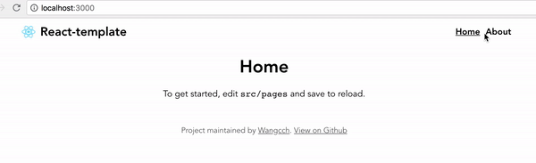

# React-template

React page template (React + React Router + SCSS)

<p align="center">
	
</p>

## Setup

```
$ git clone https://github.com/wangcch/react-template.git
$ cd react-template
```

### yarn

```
# install dependencies
$ yarn install

# serve with hot reload at localhost:3000
$ yarn start

# build for production with minification
$ yarn build
```

### npm

```
# install dependencies
$ npm install

# serve with hot reload at localhost:3000
$ npm start

# build for production with minification
$ npm run build
```

## Custom

| Edit   | Local                     |
| ------ | ------------------------- |
| pages  | <code>src/pages/\*</code> |
| router | <code>src/menu.js</code>  |
| nav    | <code>src/menu.js</code>  |
| title  | <code>src/App.js</code>   |

## License

MIT
